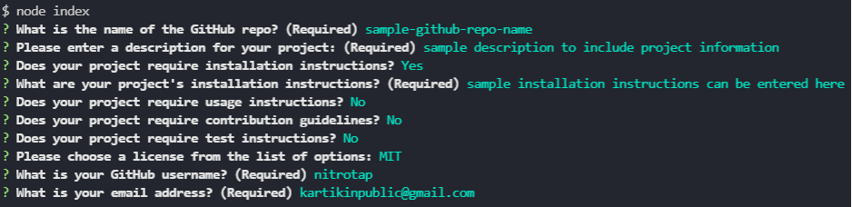

# Easy Readme

[](https://opensource.org/licenses/MIT)

## Description

Easy Readme is a command-line app using node.js, npm, and inquirer. The CLI walks the user through questions about their project, and generates a professional, customized readme.md file in the /dist folder. The readme incorporates dynamically generated table of contents, badges based on the selected license, and generates a markdown file to add to your repo.

## Table of Contents

- [Installation](#installation)
- [Usage](#usage)
- [Walk-through Video](#Walk-through)
- [License](#License)

## Installation

Node.js is required. Download from GitHub and navigate to the extracted downloaded folder from your terminal.

## Usage

The application is started with the following command:

```
node index.js
```

## Walk-through

<iframe src="https://drive.google.com/file/d/1GOrqbDBDDhmLev32BxSA7jTfq8CSXPIE/preview" width="640" height="480" allow="autoplay"></iframe>

[Walk-through Video](https://drive.google.com/file/d/1GOrqbDBDDhmLev32BxSA7jTfq8CSXPIE/view)

## Screen Shots



### [Sample Readme](./dist/sample-readme.md)


<br />

## License

[](https://opensource.org/licenses/MIT)

MIT

Copyright 2022 Kartik Jevaji
Permission is hereby granted, free of charge, to any person obtaining a copy of this software and associated documentation files (the "Software"), to deal in the Software without restriction, including without limitation the rights to use, copy, modify, merge, publish, distribute, sublicense, and/or sell copies of the Software, and to permit persons to whom the Software is furnished to do so, subject to the following conditions:

The above copyright notice and this permission notice shall be included in all copies or substantial portions of the Software.

THE SOFTWARE IS PROVIDED "AS IS", WITHOUT WARRANTY OF ANY KIND, EXPRESS OR IMPLIED, INCLUDING BUT NOT LIMITED TO THE WARRANTIES OF MERCHANTABILITY, FITNESS FOR A PARTICULAR PURPOSE AND NONINFRINGEMENT. IN NO EVENT SHALL THE AUTHORS OR COPYRIGHT HOLDERS BE LIABLE FOR ANY CLAIM, DAMAGES OR OTHER LIABILITY, WHETHER IN AN ACTION OF CONTRACT, TORT OR OTHERWISE, ARISING FROM, OUT OF OR IN CONNECTION WITH THE SOFTWARE OR THE USE OR OTHER DEALINGS IN THE SOFTWARE.`
